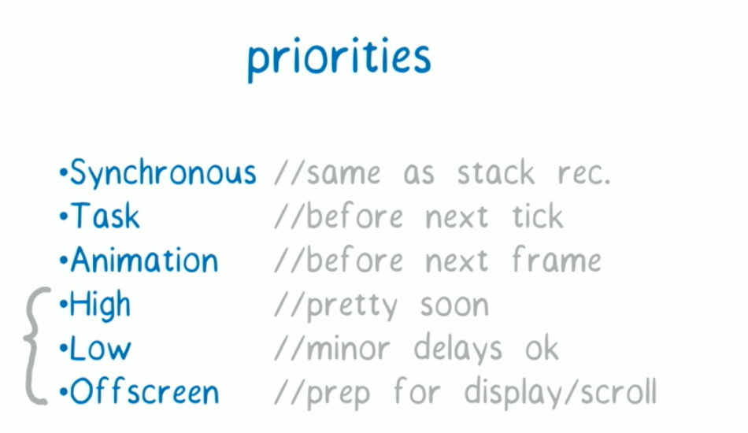

<!--
 * @Author: error: error: git config user.name & please set dead value or install git && error: git config user.email & please set dead value or install git & please set dead value or install git
 * @Date: 2024-04-01 16:36:43
 * @LastEditors: error: error: git config user.name & please set dead value or install git && error: git config user.email & please set dead value or install git & please set dead value or install git
 * @LastEditTime: 2024-04-07 10:14:21
 * @FilePath: /writings/React/react优化与fiber.md
 * @Description: 这是默认设置,请设置`customMade`, 打开koroFileHeader查看配置 进行设置: https://github.com/OBKoro1/koro1FileHeader/wiki/%E9%85%8D%E7%BD%AE
-->
> 从调度更新任务到调和 fiber，再到浏览器渲染真实 DOM，每一个环节都是渲染的一部分，至于对于每个环节的性能优化，React 在底层已经处理了大部分优化细节，包括设立任务优先级、异步调度、diff算法、时间分片都是 React 为了提高性能，提升用户体验采取的手段。所以，开发者只需要告诉 React 哪些组件需要更新，哪些组件不需要更新。于是，React 提供了 PureComponent，shouldComponentUpdated，memo 等优化手段。

> React Fiber是React v16中的一种新的协调引擎,用于提高React的性能和流畅度。它通过可中断的渲染机制和优先级调度,实现了更加细粒度的控制,从而可以在不阻塞主线程的情况下进行高效的更新。相对于之前的Reconciler,React Fiber具有更加灵活的调度能力和更高的渲染优先级,因此可以在React应用中实现更加平滑和高效的交互体验。同时,它也为React未来的扩展和优化提供了更多的可能性

> Fiber 可以提升复杂React 应用的可响应性和性能。Fiber 即是React新的调度算法（reconciliation algorithm）

> React Fiber 把更新过程碎片化，每执行完一段更新过程，就把控制权交还给 React 负责任务协调的模块，看看有没有其他紧急任务要做，如果没有就继续去更新，如果有紧急任务，那就去做紧急任务。
> react在进行组件渲染时，从setState开始到渲染完成整个过程是同步的（“一气呵成”）。如果需要渲染的组件比较庞大，js执行会占据主线程时间较长，会导致页面响应度变差，使得react在动画、手势等应用中效果比较差。

> 为了解决这个问题，react团队经过两年的工作，重写了react中核心算法——reconciliation。并在v16版本中发布了这个新的特性。为了区别之前和之后的reconciler，通常将之前的reconciler称为stack reconciler，重写后的称为fiber reconciler，简称为Fiber。

> fiber优先级策略
React Fiber里会有一个优先级机制，就是允许高优先级的任务插队
> 那么这个图里的Synchronous， Task的优先级最高，这两个主要会执行什么任务呢?有具体例子么，比如下面的High: 用户输入， low：fetching data，可以允许几秒延时。
> React Fiber 中的优先级是通过组件的 key 来决定的。如果 key 是数字，React 会认为该组件具有较高优先级。这是因为在 JavaScript 中，数字是比字符串更快进行比较的。

> React15 的 StackReconciler 方案由于递归不可中断问题，如果 Diff 时间过长（JS计算时间），会造成页面 UI 的无响应（比如输入框）的表现，vdom 无法应用到 dom 中。
> 为了解决这个问题，React16 实现了新的基于 requestIdleCallback 的调度器（因为 requestIdleCallback 兼容性和稳定性问题，自己实现了 polyfill），通过任务优先级的思想，在高优先级任务进入的时候，中断 reconciler。
> 为了适配这种新的调度器，推出了 FiberReconciler，将原来的树形结构（vdom）转换成 Fiber 链表的形式（child/sibling/return），整个 Fiber 的遍历是基于循环而非递归，可以随时中断。
> 更加核心的是，基于 Fiber 的链表结构，对于后续（React 17 lane 架构）的异步渲染和 （可能存在的）worker 计算都有非常好的应用基础